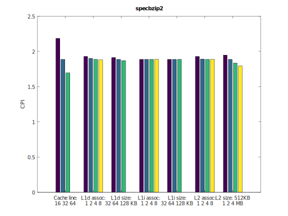
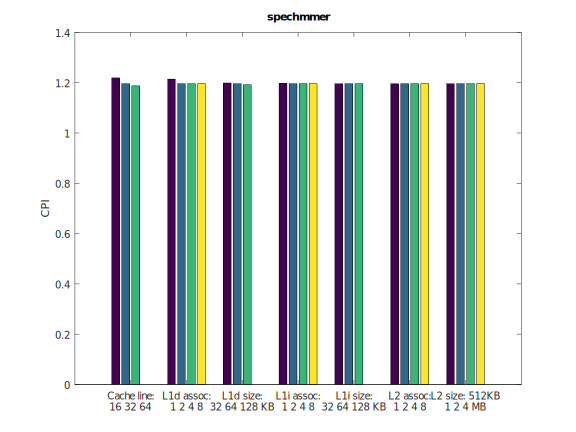
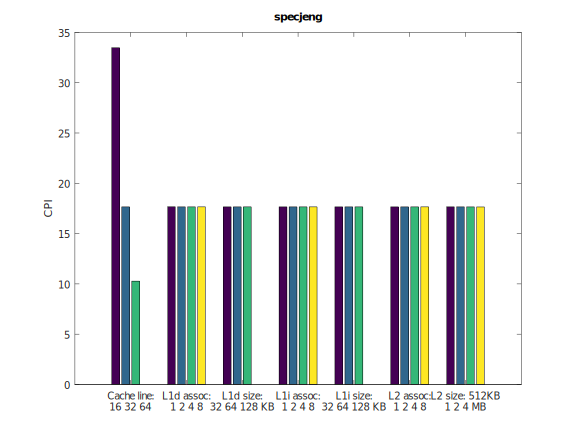
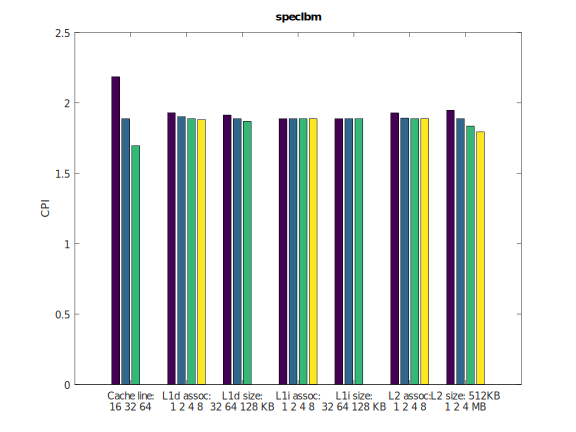
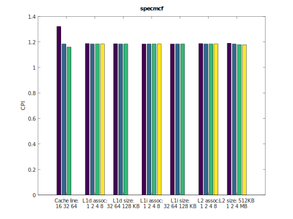

# computerArchitectureLab
_Reports from the lab assignments, for the Computer Architecure course, school of Electrical and Computer Enginneering, AUTH_

## Εργαστήριο 2: Design Space Exploration με τον gem5

### Βήμα 1

#### Ερώτημα 1

Παίρνουμε τα εξής στοιχεία από τα output files του GEM5 : 
`[system.cpu.icache] : size & assoc`, `[system.cpu.dcache] : size & assoc` , `[system.l2] : size & assoc` , `[system] : cache_line_size ` από το `config.ini`  

CLOCK = 1 GHz

| L1 icache | L1 dcache   | L2 system cache | associativity L1I / L1D / L2 | cache line |
|-----------|-------------|-----------------|------------------------------|------------|
| 32768 | 65536 | 2097152 | 2 / 2 / 8 | 64 |


#### Ερώτημα 2

Από τα output file `stats.txt` παίρνουμε τις εξής παραμέτρους:  `sim_seconds` , `system.cpu.cpi` , `system.cpu.icache.overall_miss_rate::total` , `system.cpu.dcache.overall_miss_rate::total` & `system.l2.overall_miss_rate::total`.

| Benchmarks | Execution Time | CPI | Total miss rates: Icache / Dcache | Total miss rates: L2 cache |
|------------|----------------|-----|-----------------------------------|----------------------------|
| 401.bzip2  |  0.161025 | 1.610247 | 0.000077 / 0.014675 | 0.282157 |
| 429.mcf    |  0.127942 | 1.279422 | 0.023627 / 0.002108 | 0.055046 |
| 456.hmmer  |  0.118530 | 1.185304 | 0.000221 / 0.001629 | 0.077747 |
| 458.sjeng  |  0.704056 | 7.040561 | 0.000020 / 0.121831 | 0.999972 |
| 470.lbm    |  0.262327 | 2.623265 | 0.000094 / 0.060971 | 0.999944 |


#### Ερώτημα 3

CLOCK = 2 GHz

| Benchmarks | L1 icache | L1 dcache   | L2 system cache | associativity L1I / L1D / L2 | cache line |
|------------|-----------|-------------|-----------------|------------------------------|------------|
| 401.bzip2  | 32768 | 65536 | 2097152 | 2 / 8 | 64 |
| 429.mcf    | 32768 | 65536 | 2097152 | 2 / 8 | 64 |
| 456.hmmer  | 32768 | 65536 | 2097152 | 2 / 8 | 64 |
| 458.sjeng  | 32768 | 65536 | 2097152 | 2 / 8 | 64 |
| 470.lbm    | 32768 | 65536 | 2097152 | 2 / 8 | 64 |


### Βήμα 2
Αρχικά, δημιουργήσαμε ένα σχέδιο βάσει του οποίου θα πραγματοποιηθούν πολλές προσομοιώσεις. Ορίστηκαν κάποιες τιμές δοκιμών, καθώς και προεπιλεγμένες τιμές (υπογραμμισμένες) για κάθε μία από τις εξής παραμέτρους:

* Cache line: 16 <ins>32</ins> 64
* L1 Data cache associativity: 1 2 <ins>4</ins> 8
* L1 Data cache size: 32KB <ins>64KB</ins> 128KB
* L1 Instruction cache associativity: 1 2 <ins>4</ins> 8
* L1 Instruction cache size: 32KB 64KB <ins>128KB</ins>
* L2 cache associativity: 1 2 <ins>4</ins> 8
* L2 cache size: 512KB <ins>1MB</ins> 2MB 4MB

Στη συνέχεια, με χρήση του bash script `run_benches.bash` τρέξαμε για κάθε benchmark κρατώντας κάθε φορά σταθερές τις προεπιλεγμένες παραμέτρους και αλλάζοντας μόνο μία από αυτές. Με αυτόν τον τρόπο μελετούμε την επίδραση κάθε αλλαγής στην απόδοση, η οποία για την συγκεκριμένη εργαστηριακή άσκηση ορίζεται αποκλειστικά από το CPI (Cycles Per Instruction). Έπειτα, με χρήση του έτοιμου script `read_results.sh` τα αποτελέσματα συλλέγονται και παρουσιάζονται σε γράφημα με την βοήθεια ενός matlab script. Στη συνέχεια παρουσιάζονται και σχολιάζονται τα ευρήματα.



Παρατηρούμε ότι καθοριστική επίδραση στην απόδοση του bzip2 benchmark παίζει το μέγεθος cache line. Παρατηρήσιμη επίδραση φαίνεται να έχει το μέγεθος της L2 cache και η αρχιτεκτονική της L1 data cache, ενώ τα υπόλοιπα χαρακτηριστικά δεν έχουν ουσιαστική επίδραση. Για βέλτιση απόδοση επομένως, προτείνουμε


* Cache line: 64
* L1 Data cache associativity: 8
* L1 Data cache size: 128KB
* L1 Instruction cache associativity: 1 
* L1 Instruction cache size: 32KB
* L2 cache associativity: 2 
* L2 cache size: 4MB



Εδώ φαίνεται ότι καμία παράμετρος δεν έχει καθοριστική επίδραση στην απόδοση του benchmark και το CPI είναι κοντά στο 1.2. Επομένως προτείνουμε:

* Cache line: 64
* L1 Data cache associativity: 2
* L1 Data cache size: 32KB
* L1 Instruction cache associativity: 1 
* L1 Instruction cache size: 32KB
* L2 cache associativity: 1 
* L2 cache size: 512KB



Η μοναδική παράμετρος που έχει μάλιστα δραστική επίδραση στην απόδοση είναι το μέγεθος της cache line. Επομένω προτείνουμε:

* Cache line: 256
* L1 Data cache associativity: 1
* L1 Data cache size: 32KB
* L1 Instruction cache associativity: 1 
* L1 Instruction cache size: 32KB
* L2 cache associativity: 1 
* L2 cache size: 512KB



Τα αποτελέσμα εδώ είναι παρόμοια με το benchmark jeng οπότε η αρχιτεκτονική που προτείνουμε είναι η ίδια.



Σε αυτήν την περίπτωση προτείνουμε:
* Cache line: 64
* L1 Data cache associativity: 1
* L1 Data cache size: 32KB
* L1 Instruction cache associativity: 1 
* L1 Instruction cache size: 32KB
* L2 cache associativity: 1 
* L2 cache size: 4ΜΒ


### Βήμα 3

'Εχοντας εικόνα απο τα γραφήματα από το `Βήμα 2`, παρατηρούμε ότι υπάρχει σημαντική ελάττωση στο CPI από την αλλαγή στο `Cache line` , ενώ οι παράμετροι αποδίδουν λιγότερο με την αύξηση τους ειναι τα `L1 icache associativity` , `L1 icache size` `L2 cache associativity` . Μπορούμε να πούμε ότι με την αύξηση των `Cache line` και associativity παραμέτρων , αυξάνεται και η πολυπλοκότητα του συστήματος καθώς αυξάνεται και ο αριθμός των πολυπλεκτών και των συνδέσεων. Οπότε από τη πλευρα κόστους γι' αυτές τις παραμέτρους μπορούμε να τα κοστολογίσουμε ως: cache_line_size * (2* L1_dcache_assoc + L1_icache_assoc + L2_cache_assoc ) .
Θεωρούμε διπλάσιο το κόστος της L1_dcache_assoc από το γεγονός ότι αυτή η παράμετρος απο τα γραφήματα φαίνεται να αποδίδει περισσότερο σε σχέση με τις άλλες παραμέτρους .

Όσον αφορά τα data caches , γνωρίζουμε ότι τα `L1 data caches` είναι "ακριβότερα" απο τα `L2 data caches` αλλά γρηγορότερα , έχουν όμως 8 φορές λιγότερη μνήμη συνολικά. Με μία εκτίμηση μέσα απο τις βιβλιογραφίες που ψάξαμε θα λέγαμε ότι τα μεγέθη των caches κοστολογούνται ως : 2 * (L1_icache_size + L1_dcache_size ) + L2_cache_size .

Οπότε για το συνολικό κόστος ορίζουμε τη συνάρτηση κόστους : 
```
Κ = cache_line_size * (2* L1_dcache_assoc + L1_icache_assoc + L2_cache_assoc ) + 2 * (L1_icache_size + L1_dcache_size ) + L2_cache_size 
```
Άρα για κάθε benchmark έχουμε : 

| Benchmarks | Cost |
|------------|------|
| 401.bzip2  | 
| 429.mcf    | 
| 456.hmmer  |
| 458.sjeng  | 
| 470.lbm    | 
