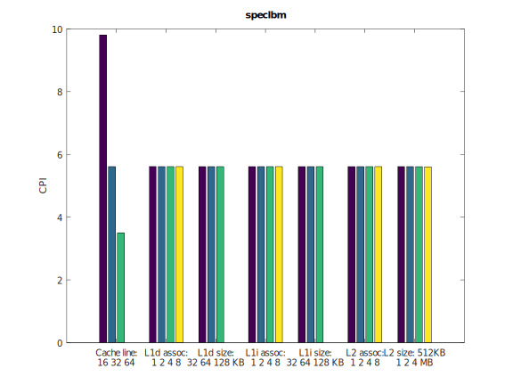

# computerArchitectureLab
_Reports from the lab assignments, for the Computer Architecure course, school of Electrical and Computer Enginneering, AUTH_

## Εργαστήριο 2: Design Space Exploration με τον gem5

### Βήμα 2
Αρχικά, δημιουργήσαμε ένα σχέδιο βάσει του οποίου θα πραγματοποιηθούν πολλές προσομοιώσεις. Ορίστηκαν κάποιες τιμές δοκιμών, καθώς και προεπιλεγμένες τιμές (υπογραμμισμένες) για κάθε μία από τις εξής παραμέτρους:

* Cache line: 16 <ins>32</ins> 64
* L1 Data cache associativity: 1 2 <ins>4</ins> 8
* L1 Data cache size: 32KB <ins>64KB</ins> 128KB
* L1 Instruction cache associativity: 1 2 <ins>4</ins> 8
* L1 Instruction cache size: 32KB 64KB <ins>128KB</ins>
* L2 cache associativity: 1 2 <ins>4</ins> 8
* L2 cache size: 512KB <ins>1MB</ins> 2MB 4MB

Στη συνέχεια, με χρήση του bash script `run_benches.bash` τρέξαμε για κάθε benchmark κρατώντας κάθε φορά σταθερές τις προεπιλεγμένες παραμέτρους και αλλάζοντας μόνο μία από αυτές. Με αυτόν τον τρόπο μελετούμε την επίδραση κάθε αλλαγής στην απόδοση, η οποία για την συγκεκριμένη εργαστηριακή άσκηση ορίζεται αποκλειστικά από το CPI (Cycles Per Instruction). Έπειτα, με χρήση του έτοιμου script `read_results.sh` τα αποτελέσματα συλλέγονται και παρουσιάζονται σε γράφημα με την βοήθεια ενός matlab script. Στη συνέχεια παρουσιάζονται και σχολιάζονται τα ευρήματα.

Παρατηρούμε ότι καθοριστική επίδραση στην απόδοση του bzip2 benchmark παίζει το μέγεθος cache line. Παρατηρήσιμη επίδραση φαίνεται να έχει το μέγεθος της L2 cache και η αρχιτεκτονική της L1 data cache, ενώ τα υπόλοιπα χαρακτηριστικά δεν έχουν ουσιαστική επίδραση. Για βέλτιση απόδοση επομένως, προτείνουμε

* Cache line: 64
* L1 Data cache associativity: 8
* L1 Data cache size: 128KB
* L1 Instruction cache associativity: 1 
* L1 Instruction cache size: 32KB
* L2 cache associativity: 2 
* L2 cache size: 4MB

Εδώ φαίνεται ότι καμία παράμετρος δεν έχει καθοριστική επίδραση στην απόδοση του benchmark και το CPI είναι κοντά στο 1.2. Επομένως προτείνουμε:

* Cache line: 64
* L1 Data cache associativity: 2
* L1 Data cache size: 32KB
* L1 Instruction cache associativity: 1 
* L1 Instruction cache size: 32KB
* L2 cache associativity: 1 
* L2 cache size: 512KB

Η μοναδική παράμετρος που έχει μάλιστα δραστική επίδραση στην απόδοση είναι το μέγεθος της cache line. Επομένω προτείνουμε:

* Cache line: 256
* L1 Data cache associativity: 1
* L1 Data cache size: 32KB
* L1 Instruction cache associativity: 1 
* L1 Instruction cache size: 32KB
* L2 cache associativity: 1 
* L2 cache size: 512KB

Τα αποτελέσμα εδώ είναι παρόμοια με το benchmark jeng οπότε η αρχιτεκτονική που προτείνουμε είναι η ίδια.

Σε αυτήν την περίπτωση προτείνουμε:
* Cache line: 64
* L1 Data cache associativity: 1
* L1 Data cache size: 32KB
* L1 Instruction cache associativity: 1 
* L1 Instruction cache size: 32KB
* L2 cache associativity: 1 
* L2 cache size: 4ΜΒ
