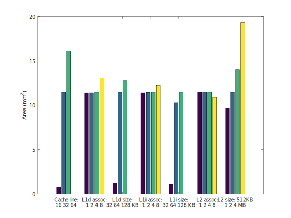
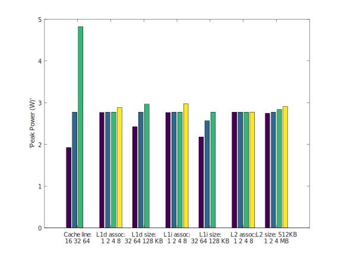

# computerArchitectureLab
_Reports from the lab assignments, for the Computer Architecure course, school of Electrical and Computer Enginneering, AUTH_

#### Παρατήρηση: Τα scripts που χρησιμοποιήθηκαν για την συλλογή και την ανάλυση των δεδομένων του 2ου και 3ου εργαστηρίου βρίσκονται στον φάκελο [spec_results_scripts_tools](https://github.com/manolismih/computerArchitectureLab/tree/master/spec_results_scripts_tools)

## Εργαστήριο 3: Energy-Delay-Area Product Optimization (gem5 + McPAT)

### Βήμα 1

#### Ερώτημα 1
> Η **δυναμική ισχύς (dynamic power)** είναι η ισχύς που ξοδεύεται για την φόρτιση και την αποφόρτιση των χωρητικών φορτίων, όταν το κύκλωμα αλλάζει κατάσταση.
> Είναι ανάλογη της χωρητικότητας του κυκλώματος, της τάσης τροφοδοσίας και της διαφοράς των επιπέδων τάσης μεταξύ των λογικών καταστάσεων.

> Η **ισχύς διαρροής (leakage power)** είναι στατική ισχύς που κατανώλεται λόγω των ρευμάτων διαρροής μέσω των τρανζίτορ, τα οποία λειτουργούν ως μη ιδανικοί διακόπτες.
> Υπάρχουν δύο μηχανισμοί διαρροής και η κλίμακα του καθενα είναι ανάλογη με το πλάτος του τρανζίστορ και εξαρτάται από την λογική κατάσταση της συσκευής.
> Η **διαρροή υποκατωφλίου (subtreshold leakage)** συμβαινει όταν ένα τρανζίστορ βρίκσκεται σε κατάσταση "off" αλλά επιτρέπει ένα μικρό ρεύμα να περάσει διαμέσου
> της εκροής και της πηγής του. Η **διαρροή πύλης (gate leakage)** αναφέρεται στο ρεύμα που διαφεύγει μέσω του ακροδέκτη της πύλης.

Από τα παραπάνω καταλαβαίνουμε ότι αν τρέξουμε δύο διαφορετικά προγράμματα στον ίδιο επεξεργαστή, το μέγεθος που θα μεταβληθεί είναι η δυναμική ισχύς.
Η δυναμική ισχύς αντανακλά "το ποιον του προγράμματος", ενώ η ισχύς διαρροής εξαρτάται μόνο από την αρχιτεκτονική του επεξεργαστή.
Η ισχύς είναι η ενέργεια ανά μονάδα χρόνου, οπότε η μέτρηση της δεν θα επηρεαστεί αν για παράδειγμα βάλουμε το ίδιο πρόγραμμα να τρέξει 1 ή 10 φορές.
Στο σενάριο αυτό, θα επηρεαστεί η συνολική ενέργεια που καταναλώνει ο επεξεργαστής.

#### Ερώτημα 2
Στο συγκεκριμένο ερώτημα μας ενδιαφέρει περισσότερο η ενέργεια και λιγότερο η ισχύς. 
Όπως φαίνεται και από το πρώτο ερώτημα, ένας επεξεργαστής δεν καταναλώνει δυναμική ισχύς όσο βρίσκεται σε αδράνεια.
Επιπλέον, δεν μπορούμε να συγκρίνουμε άμεσα την ισχύ, αλλά πρέπει να υπολογίσουμε την ενέργεια που θα καταναλωθεί για ένα πρόγραμμα,
με βάση την απόδοση κάθε επεξεργαστή, και άρα τον χρόνο για τον οποίο θα βρίσκεται σε πλήρη λειτουργία και θα καταναλωνει δυναμική ισχύ.
Επομένως, πράγματι ο επεξεργαστής των 40W θα μπορούσε τελικά να είναι πιο energy efficient, εάν ολοκληρώνει ταχύτερα τα προγράμματα,
με τρόπο ώστε η συνολική ενέργεια που δαπάνησε να είναι μικρότερη από αυτήν που δαπανάει ο επεργαστής των 5W για τα ίδια προγράμματα.

Το McPAT δεν μπορεί από μόνο του να μας δώσει την απάντηση, γιατί υπολογίζει μόνο την ισχύ και όχι την ενέργεια. 
Αυτό που χρειαζόμαστε επιπλέον είναι ο χρόνος εκτέλεσης των ίδιων προγραμμάτων που τρέχουν στους 2 επεξεργαστές, κάτι που μας δίνει ο gem5.

#### Ερώτημα 3
Για τον xeon, παίρνουμε από την έξοδο του McPAT:
```
Total Leakage = 36.8319 W
Runtime Dynamic = 72.9199 W
```

Αντιστοιχα για τον Α9
```
Total Leakage = 0.108687 W
Runtime Dynamic = 2.96053 W
```

Έστω τώρα ότι μια εφαρμογή τρέχει στον Α9 για 40 δευτερόλεπτα, και η ίδια τρέχει στον xeon για 1 δευτερόλεπτο.
Χονδρικά, ο Α9 θα καταναλώσει `(leakage+dynamic)*40 = 122,76868J` ενώ ο xeon `(leakage+dynamic)*1 + leakage*39 = 1546J`.
Επομένως, ο Xeon δεν είναι πιο energy efficient.

### Βήμα 2

#### Ερώτημα 1
Η τιμή **Area** προκύπτει απευθείας από την έξοδο που μας δίνει ο McPAT. H τιμή **delay** προκύπτει από τα αποτελέσματα που πήραμε από τον gem5, για τα benchmarks που τρέξαμε για την δεύτερη εργασία. Τελικά, η τιμή **energy** πρέπει να υπολογιστεί από το άθροισμα δυναμικής και ισχύος διαρροής, επί τον χρόνο που έτρεξε το πρόγραμμα, όπως ακριβώς στο προηγούμενο βήμα. Για ευκολία, χρησιμοποιήθηκε το έτοιμο script print_energy.py που δόθηκε μαζί με την εκφώνηση.

#### Ερώτημα 2
Η επίδραση κάθε παράγοντα στην τιμή **Area** φαίνεται στο επόμενο γράφημα. Παρατηρούμε ότι τον καθοριστικότερο ρόλο για το εμβαδόν του κυκλώματος έχουν τα μεγέθη των L1 instruction και data cache, το μέγεθος της L2 cache και το μέγεθος της cache line.



Η επίδραση κάθε παράγοντα στην τιμή **Peak Power** φαίνεται στο επόμενο γράφημα. Παρατηρούμε ότι τον καθοριστικότερο ρόλο για το εμβαδόν του κυκλώματος έχει το μέγεθος της cache line και λιγότερο σημαντικό τα μεγέθη των caches.



##### Βελτιστοποίηση γινομένου Energy Delay Area
Για να απαντήσουμε σε αυτό το ζητούμενο θα χρειαστεί να συνδυάσουμε τις πληροφορίες που μόλις αποκομίσαμε από τα διαγράμματα, τις πληροφορίες που δίνουν την μέγιστη απόδοση (από το 2ο εργαστήριο) καθώς και αριθμητικά δεδομένα που συλλέχθηκαν από όλες τις δοκιμές και βρίσκονται στο αρχείο [allResultsEnergy.txt](allResultsEnergy.txt).

Για τα benchmark specs **bzip2** **hmmer** και **mcf** οι αλλαγές στην αρχιτεκτονική του επεξεργαστή έχουν αμελητέες επιδράσεις στην απόδοση, αλλά μεγάλες στο Area και Energy, επομένως συμφέρει να χρησιμοποιηθούν όσο το δυνατόν απλούστερες αρχιτεκτονικές, με μικρά μεγέθη cache (32KB L1i και L1d, 512KB L2), directly associative και μέγεθος cacheline=16.

Για τα benchmark specs **lcm** και **jeng**, μεγαλύτερο cache line size βελτιώνει σημαντικά την απόδοση αλλά χειροτερεύει σημαντικά το Area. Σε αυτές τις περιπτώσεις θα χρειαστεί να κοιτάξουμε το αρχείο στο οποίο έχουν υπολογιστεί όλα τα γινόμενα EDAP. Παρατηρούμε ότι για cacheline size=16 το γινόμενο ελαχιστοποιείται, παρά την χειροτέρευση της απόδοσης. Το ίδιο ισχύει και για τα μικρά μεγέθη όλων των cache έναντι των μεγαλύτερων caches. Επομένως, και για αυτά τα δύο benchmarks θα προταθεί η ίδια μινιμαλιστική αρχιτεκτονική.
